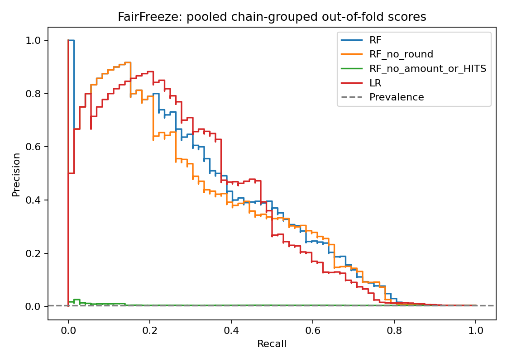

# FairFreeze

Explainable synthetic fraud-chain screening with an amount-limited human review workflow.

**Research prototype:** identifies accounts for investigation. It does not establish culpability, automate freezes, or claim court-ready evidence.

## Version 4: local complaint-review dashboard

```bash
python case_app.py
```

Open http://127.0.0.1:8765. Load the synthetic example or upload a case JSON using `examples/sample_case.json` as the format. Inspect chronological allocations, defer for further evidence or enter externally verified allocations, then export an unsigned decision record. The tracing engine runs on your computer; no case is saved by the server. The export includes a canonical input hash, timestamp, tracing assumptions, reviewer assertions and any capped hold draft.

Verified amounts are entered separately from simulated exposure. This is a local research tool: no reviewer authentication, external evidence validation, bank execution or operational approval. Do not deploy this simple server publicly. 32 unit tests pass. See `docs/CASE_APP.md`.

## Version 3: temporal matching and fresh LI holdout

Added label-free forwarding-delay and amount-matching features, bounded 2–5-hop chronological paths, time-respecting cycles and explicit search-truncation flags. Tests cover order, equal-time ambiguity, cycle detection, search bounds and label independence.

These additions did **not** improve validation AP: augmented RF scored 0.090 versus baseline RF 0.138. The validation-selected baseline scored AP 0.0040 on fresh LI-Small data, catching 1 of 63 positive accounts in its top 100. No candidate achieved the target validation precision; all threshold policies abstain. We retain the negative result rather than claim temporal features solve detection.

```bash
python fetch_ibm.py --variant both
python temporal_benchmark.py --hi external_data/HI-Small_Trans.csv --li external_data/LI-Small_Trans.csv
python dashboard.py
```

See `docs/TEMPORAL.md`, `reports/temporal_policy.json`, `reports/temporal_benchmark.json` and `reports/temporal_explanations.json`. Both sources remain synthetic; complete operational validation is not established. LI outcomes are now inspected, so future tuning needs a new holdout. 24 unit tests pass locally.

## Version 2: independent benchmark and complaint tracing

This release adds an actual IBM AML benchmark download and evaluation, chronological complaint-seeded proportional allocation, simulation tests, and dashboard evidence. It is a complete research workflow, **not a validated operational freezing system**.

```bash
python trace_demo.py
python ibm_benchmark.py --download
python dashboard.py
```

The IBM source file is approximately 476 MB. It is not included in git or this package. Its 5,078,345 transfers were audited; 189,006 same-currency Rupee transfers were retained. The test window contains 13,465 accounts and 78 positive involvement labels. The Rupee field does not establish Indian customer provenance.

| Experiment | RF | LR |
|---|---:|---:|
| Original-model cross-generator precision | 0.51% | 0.51% |
| Native IBM chronological test average precision | 0.054 | 0.006 |
| 80% validation precision target with ≥5 flags | Unattainable | Unattainable |

Both native policies abstain rather than claim target compliance. This is the measured final acceptance result: **detection gate fails**. IBM simulated laundering labels do not validate Indian fraud convictions, disputed fund ownership, or legal authority. See `docs/IBM_DATA.md` and `reports/ibm_benchmark.json`.

The tracing engine is independently usable with an explicitly supplied complaint seed and complete opening-balance ledger. It preserves the disputed total across transfers, uses cents, applies cutoff times, rejects missing evidence and unsupported FX, and leaves hold amounts unapproved. The separate review policy accepts externally verified allocations. See `docs/TRACING.md` and `reports/tracing_demo.json`.

16 unit tests passed locally, including randomized tracing conservation, chronology, cutoff handling, missing balances, duplicate IDs, currency mismatch, exact Shapley additivity and review policy checks. Dashboard script logic was checked with a DOM stub; visual rendering has not been verified in a full browser.

## Run

```bash
python -m venv .venv
# Windows: .venv\Scripts\activate
# macOS/Linux: source .venv/bin/activate
pip install -r requirements.txt
python -m unittest discover -s tests -v
python train.py --target-precision 0.8
python stress_test.py
```

Open `reports/dashboard.html` in your browser. The evaluated synthetic snapshot and generated reports are included, so you can inspect results before installing anything.

## What was built

- Five outer chain-grouped folds with three inner folds for threshold selection.
- RF and scaled LR pipelines; fold-local imputation; no ID/hop label leakage.
- Average precision, precision/recall, false positives, top-k ranking and abstention.
- Round-feature and amount/HITS ablations, plus independent seeded generator stress.
- Exact empirical interventional Shapley explanations for held-out example accounts.
- An offline review dashboard and downloadable evidence JSON.
- A separate verified-allocation hold-draft policy with no bank execution.
- Feature rebuilding, tests, dependency versions, input hashes and GitHub Actions.

## Measured results

20,000 accounts; 72 positive accounts across 16 labeled chain components. RF uses 120 trees, depth 8, balanced classes, seed 42. These results differ from earlier diagnostics that used 200 trees and a different fold grouping representation.

| Model | Mean fold AP | Precision | Recall | TP | FP | Flagged |
|---|---:|---:|---:|---:|---:|---:|
| RF | 0.421 | 63.6% | 9.7% | 7 | 4 | 11 |
| RF_no_round | 0.394 | 58.8% | 13.9% | 10 | 7 | 17 |
| RF_no_amount_or_HITS | 0.011 | Unavailable | 0.0% | 0 | 0 | 0 |
| LR | 0.433 | 74.1% | 27.8% | 20 | 7 | 27 |

The exploratory 80% inner-validation precision target did not translate into 80% outer-test precision. RF catches only seven of 72 accounts under that policy. LR has better recall on this run; neither is approved for action. There is no defensible final deployment threshold yet.



## Main finding

RF average precision collapses from 0.421 to 0.011 when amount statistics and weighted HITS are jointly removed. This does not isolate one causal feature, but it exposes reliance on amount-related signals and weak evidence for independent structural detection. Original-chain round-number observations do not represent all 72 positives.

The generator-stress script introduces independent IDs, random topology, lower-value fraud, and legitimate large/round chains, then rebuilds all features. Its background amount distribution is bootstrapped from the development data. This is synthetic robustness research, not external customer-data validation.


## Independent generator stress results

| Model | Average precision | Precision | Recall | Low-value fraud flagged | Legitimate large/round accounts flagged |
|---|---:|---:|---:|---:|---:|
| RF | 0.077 | 22.1% | 13.6% | 0/64 | 48 |
| LR | 0.074 | 15.1% | 6.4% | 0/64 | 41 |

The stress snapshot has 20,000 independent synthetic IDs, 100,203 transactions and 125 planted-positive accounts. Both models miss all 64 low-value fraud accounts at the development-selected threshold. RF flags 48 legitimate large/round-chain accounts; LR flags 41. Legitimate and fraud chains deliberately share observable patterns: transaction behavior alone cannot determine criminal intent. These results demonstrate limitations, not production performance.

## Review boundary

`review.review_hold` accepts verified non-overlapping complaint allocations, current balance, authority reference and reviewer. It drafts an amount-limited hold capped at the available balance. Account scores cannot fill those missing facts. Source transfer references in explanation reports are synthetic row references, not police-verified evidence.

## Project files

| File | Purpose |
|---|---|
| `train.py` | Nested grouped evaluation and held-out explanations |
| `core.py` | Pipelines, thresholds, grouping and exact Shapley |
| `build_features.py` | Rebuild snapshot features from transfers |
| `stress_test.py` | Independent seeded synthetic stress experiment |
| `review.py` | Verified-allocation draft hold policy |
| `tracing.py` | Complaint-seeded proportional allocation with audit |
| `trace_case.py` | JSON case tracing CLI |
| `ibm_benchmark.py` | Publisher dataset download and temporal benchmark |
| `dashboard.py` | Offline HTML report generation |
| `reports/` | Metrics, scores, explanations and dashboard |
| `docs/MODEL_CARD.md` | Assumptions, limitations and next research |
| `docs/LEGAL_SCOPE.md` | Scoped legal motivation and source register |
| `docs/GITHUB.md` | GitHub publishing instructions |

The preserved raw snapshot is sufficient to reproduce evaluation. `docs/original_generator.py` records the historical generator but retains old Windows paths and is not the runnable entry point. `build_features.py` preserves fixed seven-day buckets; it does not implement rolling time-respecting pass-through.

## Responsible portfolio description

Built a synthetic fraud-chain investigation prototype using account-level transaction and graph features, nested chain-grouped validation, exact Shapley explanations and an amount-limited human review policy. Evaluated generator shortcuts and documented failure to maintain a target precision on unseen chains.

Do not claim production fraud prevention, validated legal compliance, real-case detection accuracy, or automatic recovery of disputed funds.

## Legal motivation

The design is motivated by case-specific amount-limited restraint and reasoned review. The model does not decide statutory authority or encode a blanket rule that entire-account freezes are always unlawful. See the source and verification limits in `docs/LEGAL_SCOPE.md`.

## Reproducibility

Input SHA-256 hashes and actual Python/sklearn versions are in `reports/results.json`. `requirements-lock.txt` pins direct numerical dependencies for this run. Different BLAS implementations or library versions can change graph singular vectors and floating-point results. No model serialization needs to be trusted to inspect reports. No license is assigned automatically.
